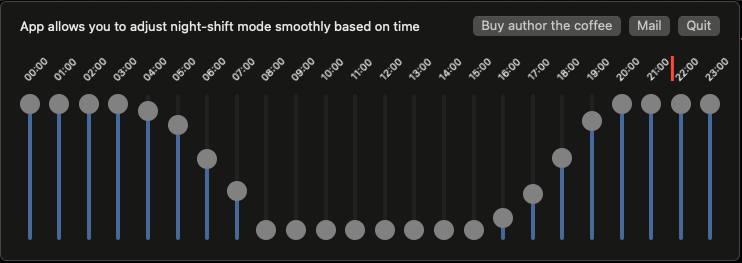

# Twilight Shift
## App adjust night-shift mode smoothly based on time of the day.
Just drag and drop app into Application directory. 
Configure Login Items in system settings.

  

Enjoy long hours in front of computer without eye strains

  

Feel free to create pull requests or change requests if you see any bugs or potential features.
